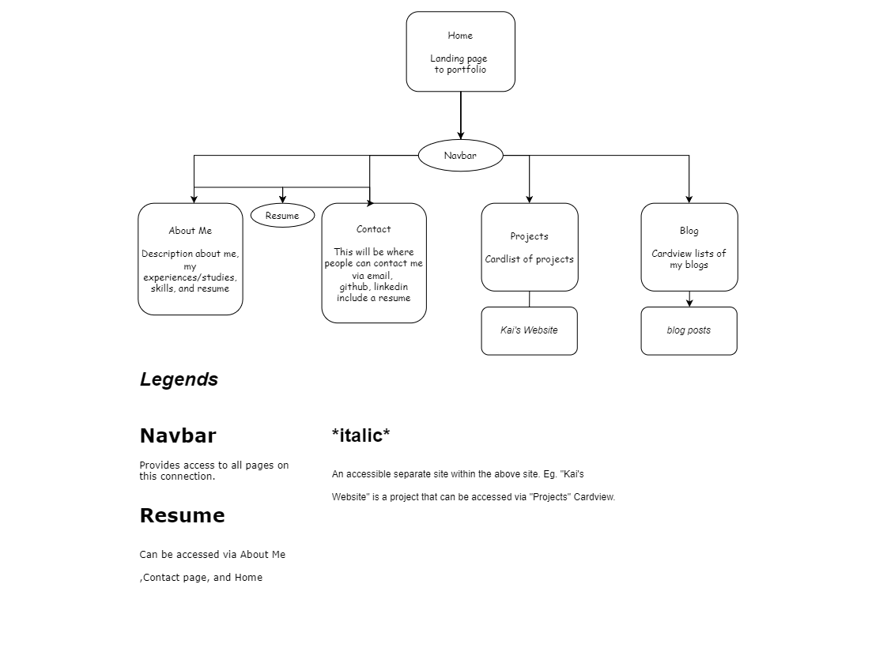

# KhoiThai_A2 Term 1 Portfolio

 

## About

Hey! You've landed at my portfolio website! 

I'm Khoi, you can call me Kai.
 Iam currently in gain of experience and knowledge, so this site will be a page of my journey/progress and work!

 

## Links

- Website Portfolio - [https://khoithai.netlify.app/](https://khoithai.netlify.app/)
- GitHub - [https://github.com/kaihx1/KhoiThai_T1A2](https://github.com/kaihx1/KhoiThai_T1A2)

 

## Purpose

My aim for this site is to showcase my skills as a developer. As I progress through Coder Academy bootcamp, learning new languages and insights, I would love to share it to whom may seek.

The audiences may be employers or managers who are looking for amateur developer/engineers. To provide them a thorough knowledge of my capabilities and work ethics.

 

## Features / Functionalities

Functionalities and features are as shown below:

<b>Functionalities</b>

- Navigation bar: Users can use the navigation bar to naviagte through the site via top right
- Responsive design: The site is designed for most device users, using flexbox and @media tools as a respond to different devices.
- Clickable links: There are links on the Contact Page to contact me via email, GitHub, LinkedIn, or my resume inserted.

<b>Features</b>

- Color scheme: A professional and visually eye-satisfying color scheme as a respond for user ease and warm natural mood.
- Image: Using images to showcase my persona and a bit about myself, interacting with users and engagements.
- Fonts: Integrating Google Fonts to amplify the users experience, the font choice appeals to the theme of the site.
- Animations: Using Animate.css to engage and catch the users attention, by using animations that appeal upon hover or clicks etc.
 

## Sitemap

This sitemap was made in prior to give me a general idea of where I was heading in site navigations. Basing my Wireframes and Design choices off of these gives me a better general idea.

   

 

## Design

Choosing a colour palette was relatively easy, and wasn't bothered much throughout the process. I wanted a simple, clear, earthy naturaly tone colour scheme that gave the audience an ease of access.

### Font

Using Google fonts I integrated it into CSS.
This font design provides a simplistic look, yet 'fun' and engaging.

  

    

### Colour Palette

Using Colors.co to, browsing and choosing based off my 'Ah that's the one' feeling.
Ideally prioritising the modern look, but desiring for an engaging audience effect.

    

 

## Target Audience

At the current stage and circumstances, my portfolio was primarily for hiring managers and recruiters, although due to the lack of time, I had not had enough time to properly publish its final touches and finishing up bits and pieces accustomed for those who are seeking for entry-level web developers. As this was done in a day.

Those on the table looking for fast-workers at efficient level, I would humbly like to say I quite suit the criteria XD.

 

## Tech Stack

- GitHub: Version Control.
- [https://app.diagrams.net/](diagrams.net): An online app used to design and create Flow Charts, used for Sitemap. 
- VS Code: Coding IDE
- HTML: Containing the elements and content of the pages.
- CSS: Styles the content displayed.
- Animate.css: An animation integration tool used to create animated effects using "animate-style", used through out the majority of the design process to enhance visual effects.

 

## Screenshots

### Homepage (Landing Page)

- Mobile Wireframe 
  

    

- Mobile Deployed

    

- Deskstop Wireframe
  

    

- Desktop deployed

    

 

## Screenshots of website

 

### Mobile

- About Page

- Blogs

- Projects

- Contact

 

### Desktop

- About Page

- Projects

- Blogs

- Contact

